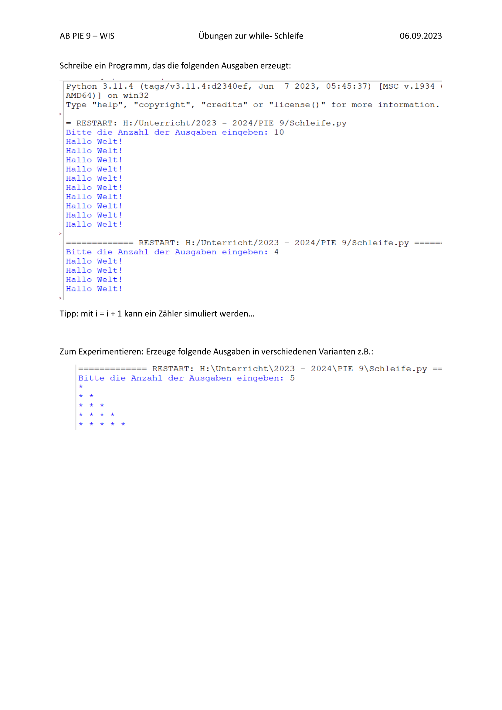

# Anzahl von Ausgaben mit der While-Schleife

## Arbeitsblatt:


Aufgabe 1

```py
wiederholungen = int(input("Gebe deine Wiederholungen ein: "))
i = 0
while i < wiederholungen:
    print("Hallo Welt!")
    i = i + 1
```

Aufgabe 2

```py
wiederholungen = int(input("Gebe deine Wiederholungen ein: "))
i = 0
while i < wiederholungen:
    i = i + 1
    print(i * "* ")
```